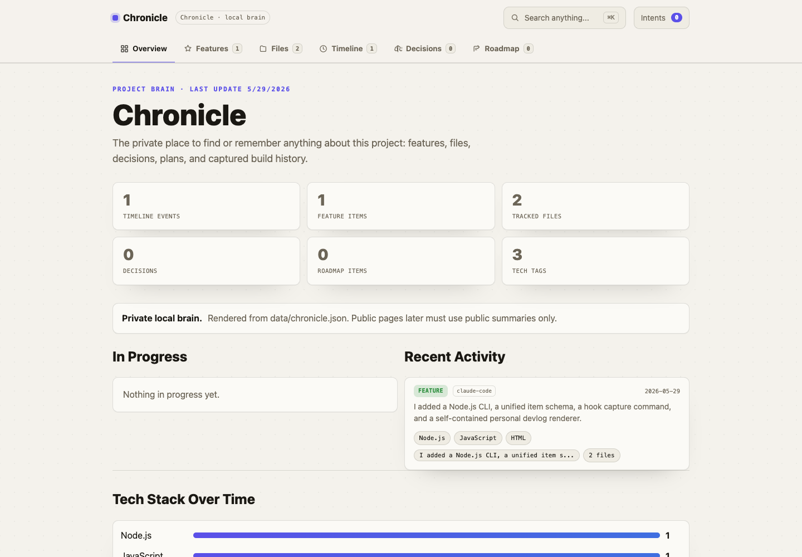

# Chronicle

Chronicle turns AI coding sessions into a private project brain, team-safe report, and public build log.

Plain English: Chronicle records the work once in `data/chronicle.json`, then renders different outputs from that same clean data file.



## What Works Now

Phase 1 through Phase 7 are complete:

- Capture from Claude Code, Codex, and Gemini CLI hook JSON.
- Parse local JSONL transcripts when a tool exposes a transcript path.
- Store work as one unified `items` model in `data/chronicle.json`.
- Render the private project brain with Overview, Features, Files, Timeline, Decisions, Roadmap, cross-links, and Command-K search.
- Render the simpler personal devlog for compatibility.
- Render a team report that skips private items.
- Draft and ship a public build log with an explicit approval gate.
- Publish the public page to GitHub Pages with `--github-pages`.
- Import Superpowers specs and plans without depending on Superpowers at runtime.
- Queue safe action intents from the project-brain page and apply them next session.
- Generate root and selective folder `_INDEX.md` maps for agents and humans.
- Validate schema and public-safety rules.
- Ship as an MIT-licensed open-source Codex plugin/package structure.

## Install Locally

Chronicle needs Node.js 20 or newer.

```bash
git clone https://github.com/karmendrachoudhary/chronical.git
cd chronical
npm test
npm link
chronicle --help
```

If you do not want to use `npm link`, run commands with:

```bash
node ./bin/chronicle.js --help
```

## Try the Demo

```bash
npm run capture:sample
npm run validate
open dist/project-brain.html
open dist/devlog.html
open dist/team-report.html
npm run public:draft -- --version v0.1.0
open dist/public-draft.html
```

The sample command reads `tests/fixtures/claude-session.jsonl`, appends one private event item to `data/chronicle.json`, renders the local HTML outputs, and refreshes `_INDEX.md`.

## Main Commands

```bash
chronicle capture --hook-input - --source-tool claude-code --render --hook-mode
chronicle render brain --store data/chronicle.json --output dist/project-brain.html
chronicle render personal --store data/chronicle.json --output dist/devlog.html
chronicle render team --store data/chronicle.json --output dist/team-report.html
chronicle render indexes --store data/chronicle.json --root .
chronicle import superpowers --store data/chronicle.json --render
chronicle actions apply --actions chronicle-actions.json --store data/chronicle.json --render
chronicle public draft --version v0.1.0 --store data/chronicle.json --output dist/public-draft.html
chronicle public ship --version v0.1.0 --approve --store data/chronicle.json --output dist/public/index.html
chronicle validate --store data/chronicle.json
```

Command meanings:

- `capture` reads hook input and writes a private Chronicle item.
- `render brain` rebuilds the main private project brain and index files.
- `render team` rebuilds the team-safe report.
- `public draft` builds a public-safe draft for review.
- `public ship` requires `--approve`, writes the final public HTML, and records a release marker.
- `import superpowers` reads Superpowers specs/plans and maps them into Chronicle items.
- `actions apply` applies safe browser-exported status changes from `chronicle-actions.json`.
- `validate` checks the local store and public-safety rules.

## Hook Setup

Chronicle includes example hook configs in `hooks/`.

### Claude Code

Merge `hooks/claude/hooks.json` into `.claude/settings.json`.

The example uses `Stop`:

```bash
node "$(git rev-parse --show-toplevel)/bin/chronicle.js" capture --hook-input - --source-tool claude-code --render --hook-mode
```

### Codex

Copy `hooks/codex/hooks.json` to `.codex/hooks.json`, or install Chronicle as a Codex plugin. The plugin-bundled hook lives at `hooks/hooks.json`.

Codex `Stop` is turn-scoped, so Chronicle captures after completed turns rather than only at full session exit.

### Gemini CLI

Merge `hooks/gemini/settings.json` into `.gemini/settings.json`.

Chronicle uses Gemini `AfterAgent`, because Gemini `SessionEnd` is best-effort and does not wait for the hook to finish. This gives safer writes, but it captures per completed agent turn.

More detail is in `docs/cross-tool-support.md`.

## Superpowers Integration

Chronicle integrates with Superpowers by reading artifacts, not by copying its workflow.

Superpowers drives the work. Chronicle records and presents the result.

Chronicle reads:

- `docs/superpowers/specs/*.md` as feature and decision items.
- `docs/superpowers/plans/*.md` as roadmap items.
- completed plan tasks as shipped features and timeline events.

Run:

```bash
npm run import:superpowers
```

The import is read-only for Superpowers files and upserts Chronicle items, so rerunning it refreshes existing imports instead of duplicating them.

## Action Intents

The project-brain page can queue safe intents, such as marking a feature shipped or moving a roadmap item in progress.

The browser page never edits files and never runs an agent. It stores the queue in browser storage and lets you copy or download `chronicle-actions.json`.

Next session, place that file at the repo root and run:

```bash
npm run actions:apply
```

Chronicle only accepts known safe actions: feature status changes and roadmap status changes.

## Public Build Log Safety

The public page is allowlist-only. Chronicle publishes nothing unless an item is marked `visibility: public`, and even then the public renderer only reads `public_summary`.

Draft first:

```bash
npm run public:draft -- --version v0.1.0
open dist/public-draft.html
```

After review, ship locally:

```bash
npm run public:ship -- --version v0.1.0 --approve
```

To test the GitHub Pages path without pushing:

```bash
npm run public:ship -- --version v0.1.0 --approve --github-pages --dry-run
```

To publish to GitHub Pages, run the same command without `--dry-run`.

## Data Model

The schema is documented in `docs/schema.md` and machine-readable at `schemas/item.schema.json`.

Important default: every item is private unless you explicitly mark it as `team` or `public`.

## Generated Index Files

Chronicle writes `_INDEX.md` at the repo root and selective per-folder `_INDEX.md` files only where they are useful. These are private local map files, not public docs.

Details: `docs/generated-indexes.md`.

## Research Foundation

Chronicle does not try to replace memory systems. The research notes are in `docs/research-notes.md`.

Chronicle stands on:

- official hook systems from Claude Code, Codex, and Gemini CLI;
- raw local transcript files where tools expose them;
- ideas from `daaain/claude-code-log` about reading Claude JSONL transcripts;
- Superpowers artifacts through a read-only import.

Chronicle does not depend on GPL-licensed session logger code.

## Contributing

- Read `CONTRIBUTING.md` for setup and safety rules.
- Read `docs/template-guide.md` before adding a new rendered view.
- Read `SECURITY.md` before changing public rendering, action intents, or generated index cleanup.

## License

Chronicle is MIT licensed. See `LICENSE`.
